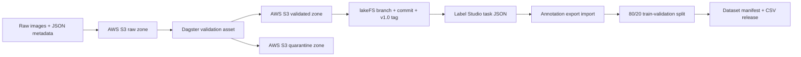

# Ophthalmic Imaging Pipeline PoC

Interview-ready proof of concept for an ophthalmic imaging dataset workflow.
The checked-in default uses synthetic OCT/RGB-style images only; no patient data
is stored in this repository.

## What It Demonstrates



- Orchestration: Dagster assets map each pipeline stage.
- Validation: image readability, metadata completeness, modality, corruption,
  and duplicate checksum checks.
- Labeling: Label Studio-compatible XML and task JSON.
- Versioning: lakeFS branch, commit, and `v1.0` tag.
- Reproducibility: fixed-seed splits and manifest counts.

## Local Setup

```bash
cd backend/ophthalmic_imaging_pipeline
python3 -m venv .venv
source .venv/bin/activate
pip install -r requirements.txt
```

Default AWS settings:

```bash
export AWS_PROFILE=dante_nv
export AWS_REGION=us-east-2
export OPHTHO_PIPELINE_BUCKET=<terraform-output-bucket-name>
export LAKEFS_DYNAMODB_TABLE_NAME=<terraform-output-lakefs_dynamodb_table_name>
export LAKEFS_ACCESS_KEY_ID=<lakefs-local-access-key>
export LAKEFS_SECRET_ACCESS_KEY=<lakefs-local-secret-key>
```

## Demo Flow

1. Generate synthetic data.

```bash
PYTHONPATH=.. python scripts/generate_sample_data.py
```

2. Start local services after AWS SSO is active.

```bash
aws sso login --profile dante_nv
docker compose up -d
```

3. Run Dagster.

```bash
PYTHONPATH=.. dagster dev -m ophthalmic_imaging_pipeline.assets
```

4. Import `label_studio/tasks_v1.0.json` into Label Studio, or generate a demo
   export for the interview:

```bash
PYTHONPATH=.. python scripts/create_demo_annotations.py
```

5. Materialize `dataset_release` in Dagster. Outputs are written under
   `output/v1.0/`.

## Real Public OCT Extension

The `real_data_adapter.py` module supports a user-downloaded Kermany/Mendeley
OCT subset. It does not download data automatically. Point it at the extracted
dataset folders (`CNV`, `DME`, `DRUSEN`, `NORMAL`) and it will create
pipeline-ready image/metadata pairs with license/source fields.

Source dataset page: https://data.mendeley.com/datasets/rscbjbr9sj/2

## Test

```bash
PYTHONPATH=. pytest backend/tests/test_ophthalmic_pipeline.py
```
